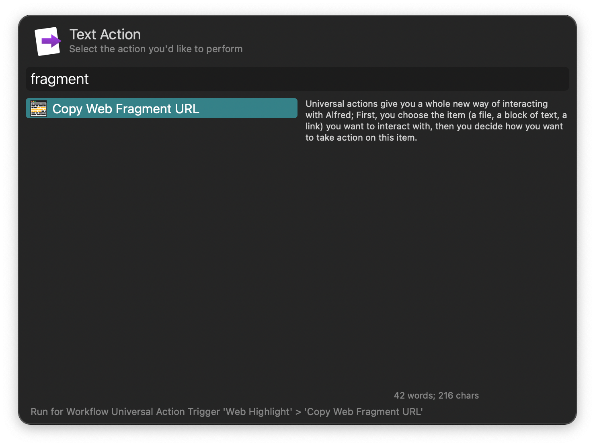
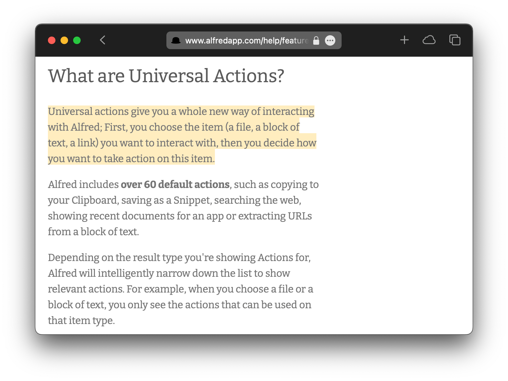

#  Web Highlight Alfred Workflow

Link to web pages and highlight text fragments

[⤓ Install on the Alfred Gallery](https://alfred.app/workflows/alfredapp/web-highlight)

## Usage

Copy the URL to a specific text section of a webpage by triggering the [Universal Action](https://www.alfredapp.com/help/features/universal-actions/) or [Hotkey](https://www.alfredapp.com/help/workflows/triggers/hotkey/) with text selected on a website. The resulting URL automatically scrolls to frame the text and highlights it.

